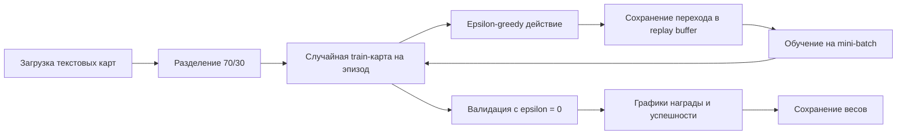
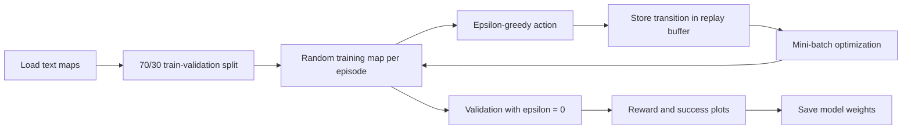

# PathFinder DQN


Проект по обучению агента с подкреплением находить путь от стартовой клетки до цели на текстовых картах с препятствиями. В репозитории реализованы DQN, Double DQN и Dueling DQN на PyTorch.

## Обзор

Среда представляет собой дискретную квадратную сетку. Каждой свободной клетке соответствует целочисленное состояние, а агент выбирает одно из четырёх действий: влево, вниз, вправо или вверх. Цель обучения — добраться от `S` до `G`, не проходя через стены `H` и не совершая лишних шагов.

Проект позволяет сравнить несколько архитектур Deep Q-Learning на небольшой и понятной среде, которую легко изменять и исследовать.

## Реализованные агенты

| Агент | Основная идея | Стабилизация обучения |
|---|---|---|
| `DQNAgent` | Нейросеть оценивает Q-value всех действий | Replay buffer, epsilon-greedy |
| `DoubleDQNAgent` | Основная сеть выбирает действие, target-сеть оценивает его | Replay buffer, target-сеть, мягкое обновление |
| `DuelingDQNAgent` | Q-value разделяется на ценность состояния и преимущество действия | Dueling-архитектура, target-сеть, Double DQN target |

При наличии CUDA агенты автоматически используют GPU, иначе работают на CPU.

## Среда

Обозначения на карте:

| Символ | Значение |
|---|---|
| `S` | Стартовая позиция |
| `G` | Цель |
| `H` | Стена или препятствие |
| Любой другой символ | Свободная клетка |

В среде реализованы:

- четыре дискретных действия;
- ограничение максимальной длины эпизода;
- необязательная случайность движения через `is_slippery=True`;
- штраф за каждый шаг и попытку пройти через стену;
- reward shaping по манхэттенскому расстоянию до цели;
- крупная награда за достижение цели;
- текстовый рендеринг карты.

## Процесс обучения



Скрипт по умолчанию обучает агента на случайно выбранных тренировочных картах, проверяет политику на отложенной выборке, строит графики и сохраняет модель в `trained_pathfinder_dqn.pth`.

## Формат карты

Карты хранятся как текстовые файлы в `maps/`. Они должны быть квадратными и содержать хотя бы один символ `S` и один `G`.

Пример:

```text
S...H
HH..H
.....
.HHH.
....G
```

## Установка

```bash
git clone https://github.com/VoskovschukDM/PathFinderDQN.git
cd PathFinderDQN

python -m venv .venv
```

Активация окружения:

```bash
# Linux / macOS
source .venv/bin/activate

# Windows PowerShell
.venv\Scripts\Activate.ps1
```

Установка библиотек:

```bash
pip install torch numpy matplotlib
```

## Запуск обучения

```bash
python run_training.py
```

Для выбора другого алгоритма замените импорт в `run_training.py`:

```python
from double_dqn_agent import DoubleDQNAgent
# или
from dueling_dqn_agent import DuelingDQNAgent
```

После этого создавайте соответствующий класс вместо `DQNAgent`.

## Структура проекта

```text
PathFinderDQN/
├── maps/                   # Карты для обучения и валидации
├── enviroment.py           # Собственная grid-world среда
├── dqn_agent.py            # Базовый DQN
├── double_dqn_agent.py     # Double DQN с target-сетью
├── dueling_dqn_agent.py    # Dueling Double DQN
├── run_training.py         # Обучение, валидация, графики и сохранение
└── README.md
```

## Архитектура модели

Базовая модель переводит индекс клетки в обучаемый embedding, после чего обрабатывает его полносвязными слоями:

```text
индекс состояния
    ↓
Embedding
    ↓
Linear(128) + ReLU
    ↓
Linear(128) + ReLU
    ↓
Q-value каждого действия
```

В Dueling-версии выход разделяется на value- и advantage-ветки:

```text
Q(s, a) = V(s) + A(s, a) - mean(A(s, ·))
```

## Что демонстрирует проект

- самостоятельную реализацию алгоритмов DQN без высокоуровневого RL-фреймворка;
- replay buffer и оптимизацию Bellman target;
- epsilon-greedy стратегию и уменьшение epsilon;
- синхронизацию основной и target-сети;
- проектирование собственной среды и функции награды;
- разделение карт на обучение и валидацию;
- сохранение моделей и визуализацию метрик.

## Возможные улучшения

- добавить `requirements.txt` и конфигурацию экспериментов;
- сохранять графики и числовые метрики в файлы;
- сравнивать три алгоритма единым benchmark-скриптом;
- фиксировать seed для Python, NumPy и PyTorch;
- добавить тесты переходов и расчёта награды;
- исследовать координатное или свёрточное представление состояния;
- опубликовать реальные кривые обучения и success rate.

# PathFinder DQN


A reinforcement-learning project that trains an agent to navigate from a start cell to a goal on text-based maps with obstacles. The repository contains implementations of DQN, Double DQN and Dueling DQN in PyTorch.

## Overview

The environment is a discrete square grid. Each free cell is represented by an integer state, and the agent chooses one of four actions: left, down, right or up. The learning objective is to reach `G` from `S` while avoiding walls marked as `H` and minimizing unnecessary steps.

The project focuses on comparing several Deep Q-Learning architectures while keeping the environment and training pipeline small enough to inspect and modify.

## Implemented agents

| Agent | Main idea | Stabilization techniques |
|---|---|---|
| `DQNAgent` | A neural network estimates Q-values for all actions | Replay buffer, epsilon-greedy exploration |
| `DoubleDQNAgent` | The online network selects the next action while the target network evaluates it | Replay buffer, target network, soft updates |
| `DuelingDQNAgent` | Q-values are decomposed into state value and action advantage | Dueling architecture, target network, Double DQN target |

All agents automatically use CUDA when it is available and otherwise run on CPU.

## Environment

Map symbols:

| Symbol | Meaning |
|---|---|
| `S` | Start position |
| `G` | Goal |
| `H` | Wall or obstacle |
| Any other symbol | Free cell |

The environment supports:

- four discrete movement actions;
- configurable maximum episode length;
- optional stochastic movement with `is_slippery=True`;
- penalties for every step and for attempts to move into a wall;
- reward shaping based on Manhattan distance to the goal;
- a large terminal reward for reaching the goal;
- ANSI-style text rendering.

## Training pipeline



The default script trains on randomly selected training maps, evaluates the learned policy on unseen validation maps, plots reward and pass-rate histories, and saves the model as `trained_pathfinder_dqn.pth`.

## Map format

Maps are plain text files in `maps/`. They should be square and contain at least one `S` and one `G`.

Example:

```text
S...H
HH..H
.....
.HHH.
....G
```

## Installation

```bash
git clone https://github.com/VoskovschukDM/PathFinderDQN.git
cd PathFinderDQN

python -m venv .venv
```

Activate the environment:

```bash
# Linux / macOS
source .venv/bin/activate

# Windows PowerShell
.venv\Scripts\Activate.ps1
```

Install the required libraries:

```bash
pip install torch numpy matplotlib
```

## Run training

```bash
python run_training.py
```

To train another implementation, change the agent import in `run_training.py`:

```python
from double_dqn_agent import DoubleDQNAgent
# or
from dueling_dqn_agent import DuelingDQNAgent
```

Then instantiate the corresponding class instead of `DQNAgent`.

## Project structure

```text
PathFinderDQN/
├── maps/                   # Text maps used for training and validation
├── enviroment.py           # Custom grid-world environment
├── dqn_agent.py            # Basic DQN implementation
├── double_dqn_agent.py     # Double DQN with a target network
├── dueling_dqn_agent.py    # Dueling Double DQN implementation
├── run_training.py         # Training, validation, plotting and saving
└── README.md
```

## Model architecture

The basic network first converts a discrete cell index into a trainable embedding and then processes it with fully connected layers:

```text
state index
    ↓
Embedding
    ↓
Linear(128) + ReLU
    ↓
Linear(128) + ReLU
    ↓
Q-value for each action
```

The Dueling variant replaces the final block with separate value and advantage branches and combines them as:

```text
Q(s, a) = V(s) + A(s, a) - mean(A(s, ·))
```

## Engineering highlights

This project demonstrates:

- implementation of DQN algorithms without a high-level RL framework;
- replay-buffer sampling and Bellman-target optimization;
- epsilon-greedy exploration and epsilon decay;
- online and target network synchronization;
- custom environment and reward-shaping design;
- train/validation separation for reinforcement-learning experiments;
- model persistence and metric visualization.

## Possible improvements

- add `requirements.txt` and reproducible experiment configuration;
- save plots and numeric metrics instead of only displaying them;
- compare all three agents in a single benchmark script;
- add fixed random seeds for PyTorch, NumPy and Python;
- include automated tests for transitions and reward calculation;
- add convolutional or coordinate-based state representations;
- publish measured success rates and training curves in the repository.
